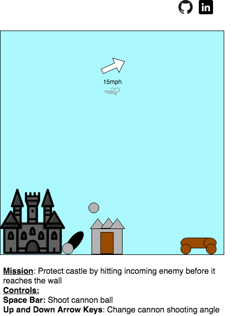

# Defend your home

## Background and Overview

Defend your home is a 2D game where the user uses a cannon to defend his home from getting attacked by an enemy.

## MVP

- [ ] Users will be able to use keys to adjust cannon angle and shoot to defend your home
- [ ] As game progresses, user will experience different levels of difficulties
- [ ] Hear sounds on collision
- [ ] See previous highscore

## Wireframes

This app will consist of a single screen with the game loaded. Instructions will be included below the game screen and links to the github and my LinkedIn will be included.

## Technologies

This project will be built using the following:

- Vanilla JavaScript for DOM manipulation.
- HTML and CSS for display of game.
- Webpack to bundle and serve the various scripts.

## Implementation Timeline

**Over the weekend**

- [ ] Worked on general game structure and handling collisions between different objects.
- [ ] General controllers for users to use for gameplay

Day 1: Setup with webpack and add layers to game. Wind layer to increase difficulty of game.

- [ ] Get webpack working with files
- [ ] Implement wind layer for gameplay

Day 2: Learn how to add sounds for gameplay and increase difficulty of gameplay

- [ ] Have sound whenever collision occurs
- [ ] Increase difficulty of game as player increases score

Day 3: Implement a way to keep track of high scores
- [ ] record current player's score
- [ ] display current player scores

Day 4: Style the front end of game and ensure smooth gameplay

- [ ] Make game look better
- [ ] Fix any bugs from gameplay
