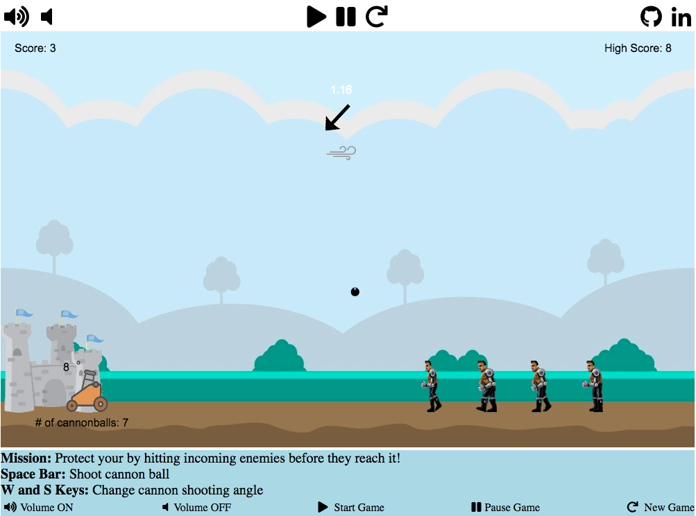

# Defend your home

## Background and Overview

Defend your home is a 2D game where the user utilizes a cannon to defend his/her home from getting attacked by enemies.

[Live Demo](https://capoxix.github.io/canvas/)



## Technologies

- Vanilla JavaScript for DOM manipulation.
- HTML5 and CSS3 to display the different game components.
- Webpack to bundle and serve the various scripts.

## Features

- User game control for changing cannon angle and shooting cannonball
- Wind effects shown with direction and strength
- Sound effects when cannonball hits target
- Current score and highest score
- Control of gameplay: Start, Pause, New Game, Volume ON/OFF

## Implementation of Game

For collision handling, I measured the distance between their positions and compared it to the addition of both object's  occupied radius. If the distance is less than their radius, then they are colliding with each other.

```js
isCollidedWith(otherObject){
  let centerDist = Util.dist(this.pos, otherObject.pos);
  return centerDist < (this.radius + otherObject.radius);
}
```

To separate the different angles of the game's cannon and wind, I used geometry equations .

```js
this.radian = Math.PI * (90- this.angle)/180;
this.airTime = 0;
this.pos[1] = Math.cos(Math.PI* this.angle/ 180)* -38 + this.pos[1];
this.pos[0] = Math.sin(Math.PI* this.angle/180) * 38+ this.pos[0];

this.verticalVelocity = Math.sin(this.radian) * options.vel[1];
this.horizontalVelocity = Math.cos(this.radian) * options.vel[0];

this.windRadian = Math.PI * this.game.windAngle / 180;
this.windVerticalVelocity = Math.sin(this.windRadian) * this.game.windVelocity;
this.windHorizontalVelocity = Math.cos(this.windRadian)* this.game.windVelocity;
```

In order to make the game come to live, I used a sprite sheet that has the object's different looks when moving, and a delay variable to show the different look after every 15 frame.

```js
draw(ctx){
  let enemyImg = document.getElementById('enemy');
    this.animationDelay += 1;

  if (this.animationDelay++ >= 15){
    this.animationDelay = 0;
    this.animationCount++;

    if (this.animationCount >= this.enemyAnimation.length){
      this.animationCount = 0;
      this.enemyAnimation[this.animationCount];
    }

    ctx.drawImage(enemyImg,  this.enemyAnimation[this.animationCount][0],   this.enemyAnimation[this.animationCount][1],
        this.enemyAnimation[this.animationCount][2],
        this.enemyAnimation[this.animationCount][3], this.pos[0],this.pos[1], 30,75);
  } else {
    ctx.drawImage(enemyImg,  this.enemyAnimation[this.animationCount][0],   this.enemyAnimation[this.animationCount][1],
        this.enemyAnimation[this.animationCount][2],
        this.enemyAnimation[this.animationCount][3], this.pos[0],this.pos[1], 30,75);
  }
}
```
